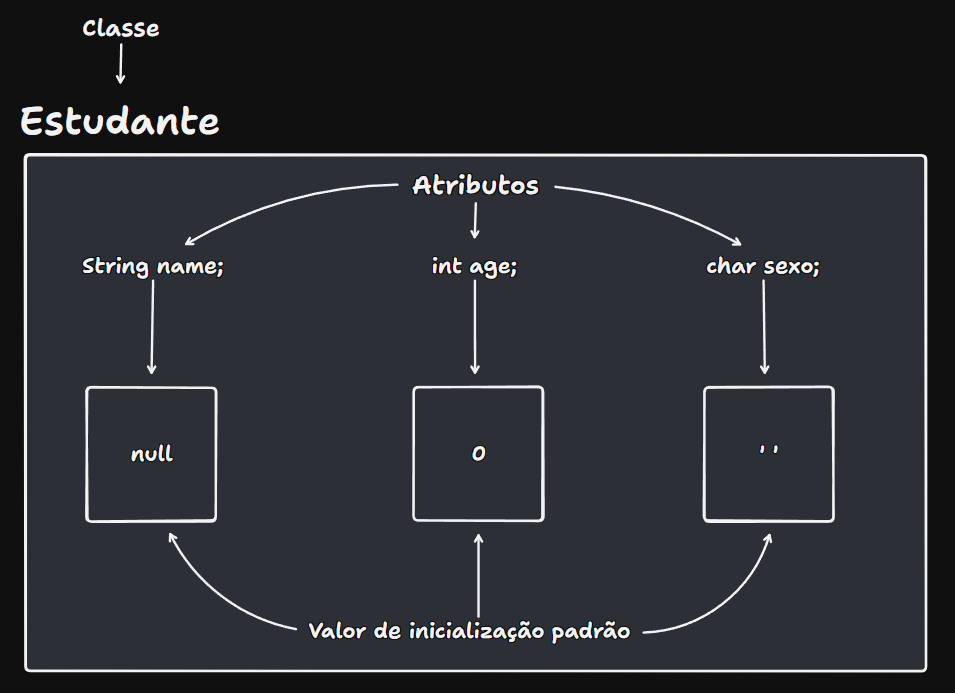
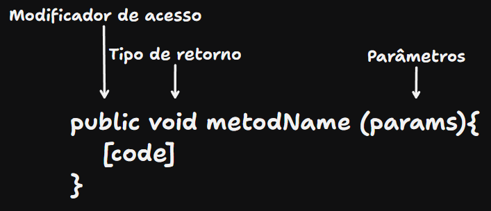
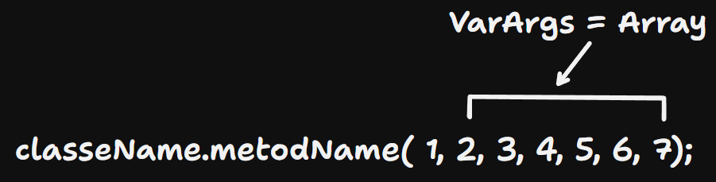
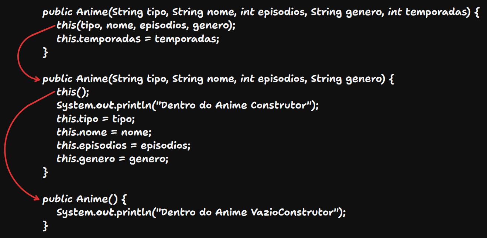

# Introdução a POO em Java

---

## 📅 - 04/03/2025⤵️

### Classes

- Estrutura da Classe Estudante:
  - ```
      public class Estudante {
          public String name;
          public int age;
          public char sexo;
      }
    ```
  - 
  - Declaração de um objeto tipo 'Estudante'
    - ```
        Estudante estudante = new Estudante();
        estudante.name = "Luffy";
        estudante.age = 21;
        estudante.sexo = 'M';
      ```
    - > Na declaração de um objeto de tipo 'Estudante' é usando uma variável de referência para fazer esse link com o objeto para termos acesso aos seus atributos.
    - > Na criação de um objeto com atributos já definidos dentro da classe, esses atributos seram inicializados com os seus respectivos valores padrões, podendo também já serem definidos por um valor padrão inicializado dentro na classe como, por exemplo: 
      - ```
        public class Estudante {
          public String name = Luffy;
          public int age = 21;
          public char sexo = 'M';
          }
        ```
  - Coesão
    1. Um propósito por classe.
    2. Não por a execução(main) da classe no próprio arquivo da classe.
    3. Altamente coeso é algo ótimo
  - Referência de objetos
    - É possível um mesmo objeto ser referenciado por 2 variáveis ao mesmo tempo.
      - ```  
        Carro carro1 = new Carro();
        Carro carro2 = new Carro();
        
        carro2.nome = "Mitsubishi";
        carro2.ano = 2012;
        carro2.modelo = "Lancer Evolution IX";
        carro2.cor = "Cinza Strato";
        
        // atribuição para que o 'carro1' referencie o mesmo objeto que o 'carro2'
        
        carro1 = carro2; 
        ```

---

## 📅 - 05/03/2025⤵️

### Métodos

- São funções que fazem algo dentro da classe retornando algum valor ou não.


- 
    - Modificador de acesso: Usado para a visualização do acesso.
  - Tipo de retorno:
    - void - Não retorna nada, mas normalmente ou imprimi algo, ou altera por referência.
      - Obs: Pode se usar o 'return', mas apenas para usá-lo como um 'break'.
    - tipos primitivos - vai retornar um valor do seu respectivo tipo.
  - Parâmetros: Usados para inserir algo que irá ser utilizado dentro do método.
  - ```
    public void somaDoisNumeros(int num1, int num2) {
        System.out.println("Soma dos números :");
        System.out.print(num1+num2);
    }
    ```
- VarArgs: Um jeito de usar um array de mesmo tipo sem precisar declara-lo anteriormente.
  - ```
     // Varargs declaração como parâmetro dentro de um método
    
     public void metodName (int value, int... numbers){
       [code]
     }
    ```
  - 
    - Do número 2 até o final, ele transforma em um array de inteiros, sendo importante caso utilizar o varargs é mantelo como último parâmetro para que ele reconheça todos os valores inseridos.
- >This: é usado para diferenciar um atributo da classe, de um parâmetro de mesmo nome.
  >>```
  >> public class Pessoa {
  >>    public String nome;
  >>    public int idade;
  >>
  >>    public void comparaIdade (int idade) {
  >>       if (this.idade == idade) {
  >>          System.out.println("Idades iguais!");
  >>       }
  >>    }
  >> }
  >>```

---

### Modificadores de Acesso

- Private
  - Usado para esconder atributos e métodos, assim apenas a própria objeto podendo utilizá-lo.
  - ```
    public class Pessoa {
        private String nome;
        private int idade;
    }
    ```
- set
  - Usado para inserir valor nos atributos, assim podendo por exceções e verificações no método, para ser válido os valores colocados.
  - ``` 
    public void setNome(String nome) {
        this.nome = nome;
    }

    public void setIdade(int idade) {
        if (idade < 0) {
            System.out.println("Idade inválida!");
            return;
        } else {
            this.idade = idade;
        }
    }
    ```
- get
  - Usado para pegar esses valores dos atributos.
  - ``` 
    public String getNome() {
        return nome;
    }

    public int getIdade() {
        return idade;
    }
    ```

--- 

## 📅 - 07/03/2025⤵️

### Sobrecarga de Métodos

- Consiste em usar métodos de mesmo nome, porém com a quantidade ou tipos parâmetros diferentes.
  - ``` 
    public void init(String tipo, String nome, int episodios) {
        this.tipo = tipo;
        this.nome = nome;
        this.episodios = episodios;
    }

    public void init(String tipo, String nome, int episodios, String genero) {
        this.tipo = tipo;
        this.nome = nome;
        this.episodios = episodios;
        this.genero = genero;
    }
    ```
    
---

### Construtores

- É um inicializador dos objetos, que se é posto alguns parâmetros, no momento de criação do objeto é obrigatório o uso deses parâmetros. Amenos que tenha uma sobrecarga de construtores e seja criado um construtor sem parâmetros.
  - ``` 
    // Na classe
    
    public Anime(String tipo, String nome, int episodios, String genero) {
        System.out.println("Dentro do Anime Construtor");
        this.tipo = tipo;
        this.nome = nome;
        this.episodios = episodios;
        this.genero = genero;
    }
    
    // Na main
    
    Anime anime = new Anime("TV","Solo Leveling",12,"Ação");
    ```
- Sobrecarga de Construtores
  - ``` 
    public Anime(String tipo, String nome, int episodios, String genero) {
        System.out.println("Dentro do Anime Construtor");
        this.tipo = tipo;
        this.nome = nome;
        this.episodios = episodios;
        this.genero = genero;
    }
    
    public Anime() {
        
    }
    ```
  - This()
    - É obrigatoriamente a 1.ª linha do corpo de um construtor, quando utilizado.
    - Só pode ser usado dentro de construtores.
    - É usado para se referir a outro construtor.
      - 

---

### Blocos de Inicialização de Instância

- São blocos de código que são executados quando uma instância de uma classe é criada.
  - Eles são úteis quando a mesma inicialização precisa acontecer independentemente de qual construtor é chamado.
  - É colocado antes dos construtores e após os atributos.
  - É executado antes do construtor.
  - ```
    public class Pessoa {
    private String[] hobbies;
    
    // Bloco de inicialização de instância
    {
        // Inicialização do array
        hobbies = new String[5];
        hobbies[0] = "Leitura";
        hobbies[1] = "Música";
        hobbies[2] = "Esportes";
        hobbies[3] = "Culinária";
        hobbies[4] = "Viagens";
        
        System.out.println("Array de hobbies inicializado no bloco de inicialização");
    }
    
    // Construtores diferentes não precisam repetir a inicialização do array
    public Pessoa() {
        // O bloco de inicialização já inicializou o array hobbies
        System.out.println("Construtor padrão executado");
    }
    
    public Pessoa(String nome) {
        // O bloco de inicialização já inicializou o array hobbies
        // Apenas definimos o nome
        System.out.println("Construtor com nome executado: " + nome);
    }
    ```
    
---

### Modificador Estático

- Faz o atributo pertencer à Classe e não mais somente os objetos, assim todos os objetos compartilham de um mesmo valor.
  - ``` 
    // Na classe
    
    public class Carro {
      public static double velocidadeLimite = 250;
      ...
    }
    
    // Na main
  
    public static void main(String[] args) {
      ...
      carro.imprime();
      carro2.imprime();
    
      Carro.velocidadeLimite = 450;
    
      carro3.imprime();
    }
    
    // No terminal
    
    ---------------------
    Marca: Toyota
    Modelo: Supra
    Velocidade Máxima: 280.0
    Velocidade Limite: 250.0
    ---------------------
    Marca: Mitsubishi
    Modelo: Lancer EVO X
    Velocidade Máxima: 300.0
    Velocidade Limite: 250.0
    ---------------------
    Marca: Mitsubishi
    Modelo: Eclipse
    Velocidade Máxima: 260.0
    Velocidade Limite: 450.0
    ```
    
---

### Métodos Estáticos

- É declarado usando a palavra-chave 'static' e pertence à classe em vez de pertencer a instâncias específicas da classe. Isso significa que você pode chamar um método estático sem precisar criar um objeto da classe.
  1. Um método estático só pode acessar diretamente outros membros estáticos (variáveis ou métodos) da classe.
  2. Não podem usar a palavra-chave this: Como não estão associados a nenhuma instância específica, não existe um "this" para referenciar.
  3. São úteis quando você precisa de funcionalidades que não dependem do estado do objeto, como operações matemáticas, conversões, manipulação de strings ou lógica que é compartilhada entre todos os objetos de uma classe.
  - ``` 
    public static double getVelocidadeLimite() {
        return Carro.velocidadeLimite;
    }

    public static void setVelocidadeLimite(double velocidadeLimite) {
        Carro.velocidadeLimite = velocidadeLimite;
    }
    ```
    
---

### Bloco de Inicialização Estático

- É declarado usando a palavra-chave 'static'.
  - ``` 
    // Bloco de inicialização Estática
    
    static{
        // Inicialização do array
        episodios = new int[5];
        for (int i = 0; i < episodios.length; i++){
            episodios[i] = i+1;
        }
        System.out.println("Array de episodios inicializado no bloco de inicialização estático");
    }
    ```
  - São executados apenas 1 vez quando a classe é carregada pela JVM.
  - Não pode acessar atributos de instância.

---

## 📅 - 10/03/2025⤵️

### Arrays com Objetos

- ``` 
  // Na classe
  
  public class Jogador {
    private String nome;

    public void Imprimir() {
        System.out.println("Nome: " + nome);
    }
  }
  
  // Na main
  
  public static void main(String[] args) {

      Jogador jogador1 = new Jogador("Menino Ney");
      Jogador jogador2 = new Jogador("Coutinho");
      Jogador jogador3 = new Jogador("Rafinha");

      Jogador[] jogadores = {jogador1, jogador2, jogador3};

      for(int i = 0; i < jogadores.length; i++){
          jogadores[i].Imprimir();
      }
  }
  ```
  - Mesmo jeito de declarar uma arrays normal só que usando as classes desejadas para o array.

---

## 📅 - 11/03/2025⤵️

### Associação

- Uma associação estabelece como objetos de diferentes classes "conhecem" uns aos outros e interagem entre si.
  - Pessoa 1 ---> 1 CPF 
  - Dono 1 ---> N Cachorro | 1 pra N
  - Aluno N ---> N Aula | N pra N
- Características:
  1. Independência: Os objetos associados existem independentemente uns dos outros. Se um objeto for destruído, o outro pode continuar existindo. 
  2. Direção: A associação pode ser:
     1. Unidirecional: Apenas uma classe conhece a outra
     2. Bidirecional: Ambas as classes conhecem uma à outra 
  3. Cardinalidade: Define quantos objetos participam da associação (um-para-um, um-para-muitos, muitos-para-muitos)


1. Associação Simples (one-to-one):
   ``` 
    public class Pessoa {
        private CarteiradeIdentidade identidade; 
        public Pessoa(CarteiradeIdentidade identidade) {
            this.identidade = identidade;
        }
    }

    public class CarteiradeIdentidade {
        private String numero;

        public CarteiradeIdentidade(String numero) {
            this.numero = numero;
        }
    }
   ```
2. Associação Um-para-Muitos (one-to-many):
   ``` 
    public class Professor {
        private String nome;
        private Aluno[] alunos;
    
        public Professor(String nome, Aluno[] alunos) {
            this.nome = nome;
            this.alunos = alunos;
        }
    }

    public class Aluno {
        private String nome;

        public Aluno(String nome) {
            this.nome = nome;
        }
    }
   ```
3. Associação Muitos-para-Muitos (many-to-many):
   ``` 
    public class Estudante {
        private String nome;
        private Curso[] cursos;

        // métodos para matricular em cursos
    }

    public class Curso {
        private String nome;
        private Estudante[] estudantes;

        // métodos para adicionar estudantes
    }
   ```
   
---

### Leitura de dados pelo console

- ```
  Scanner entrada = new Scanner(System.in);
  ```